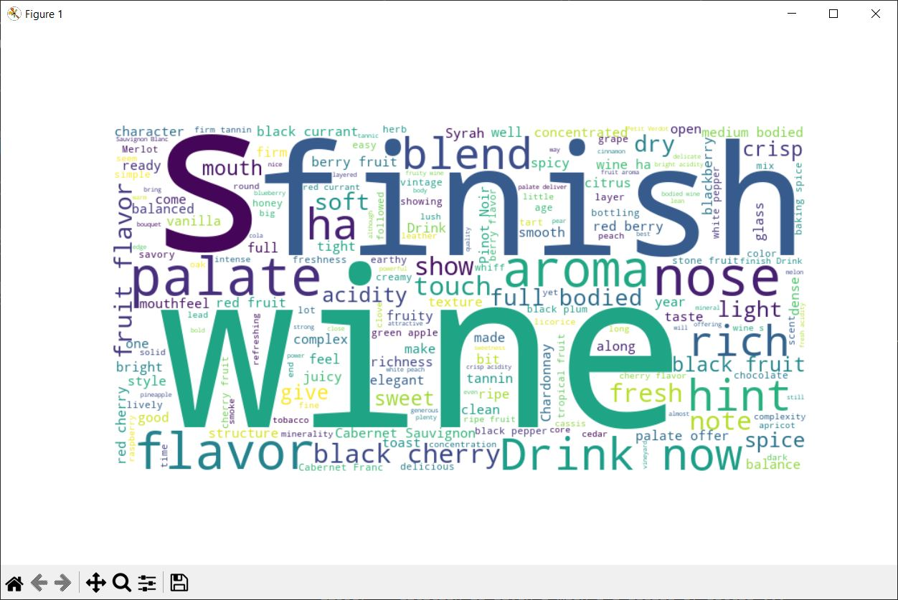

# Description

This project implements a machine learning model that trains on a description feature (text) of a dataset to analyze the sentiment behind it i.e., whether the reviews are positive or negative. Later on, we have made a webpage on this training model using flask that implements the same model on a webpage.

## Tokenized Description WordCloud

## Lemmatized Tokens WordCloud

## Stemmed Tokens WordCloud

## Filtered Tokens WordCloud

### Drawbacks
Since this model is in its early stages, the model is not yet able to define a neutral review. It only discriminates between positive and negative, i.e., its implementation is very binary.